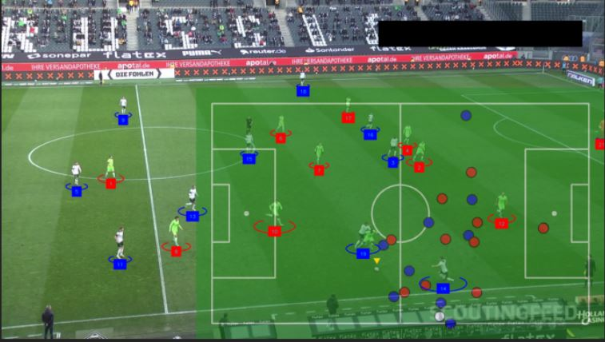

# computerVisionFootballv2

## Intro
Project uses object detection model & processes it's output to analyze the video of a football match & detect/calculate:

* estimate player, referee and ball positions
* estimate pitch key points
* project the players & ball to a 2d pitch

## Input
Input video is 08fd33_4.mp4

## Processing the input
All the code is in computer_vision_football.ipynb

## Output
Output video is 08fd33_4_PROC_1.mp4

## Reference
https://www.youtube.com/watch?v=aBVGKoNZQUw&t=1044s
